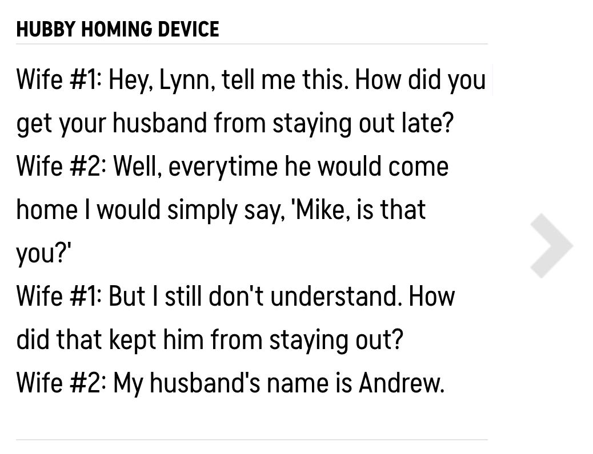
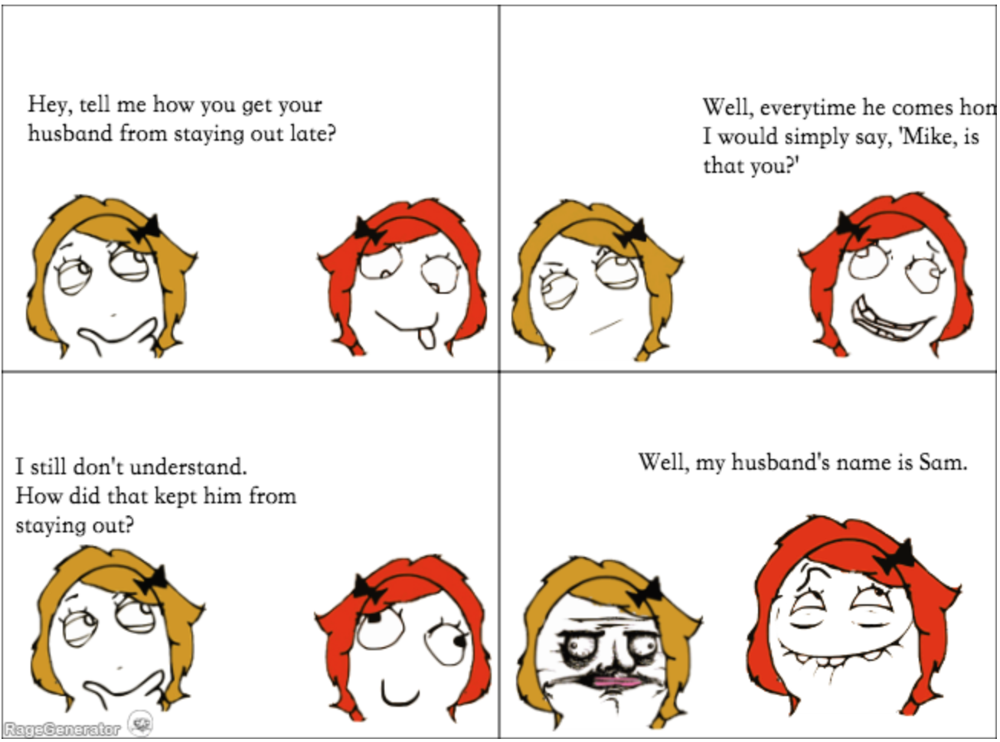

# Joke to Comic Generator

## Background and Motivation
"Humor" is always being a hard topic since it's highly personal and hard to measure.
It's really cool if I can generate a comic from a joke.
This project is the final project for the course "Conginitive Computing 2018".
The goal of this course is "beyond recognition", so I wish to deliver a project that fits this goal.

## Problem Definition
Given a joke x, output a comic y that is q

## Challenge
- Image often contains more information that text. The relation between text and image is one-to-many, and the context also affects choosing "correct" image representation.
- There is no dataset nor previous work for such task.

## Methodology

I want to give some contraints to lower the difficulty

### "Joke" Constraint
- The joke should be in conversation format

### "Comic" Constraint
- Instead of "GAN" the whole image, I want to use the pre-built comic ingredient "rage comic".

### Type-1 Joke: question and answer

### Type-2 Joke: 
- conversation between two people
- 4-frame cartoons 

## References
- Joke dataset https://github.com/taivop/joke-dataset

