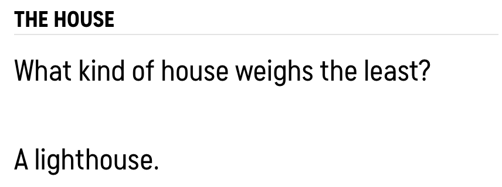
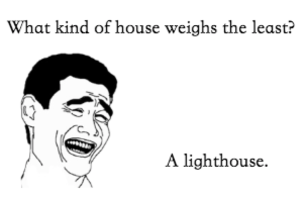
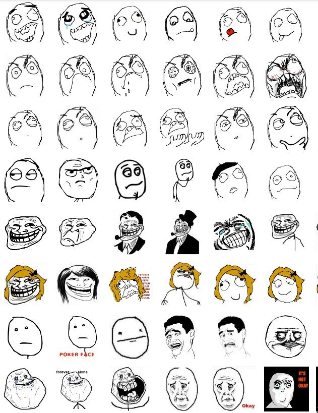
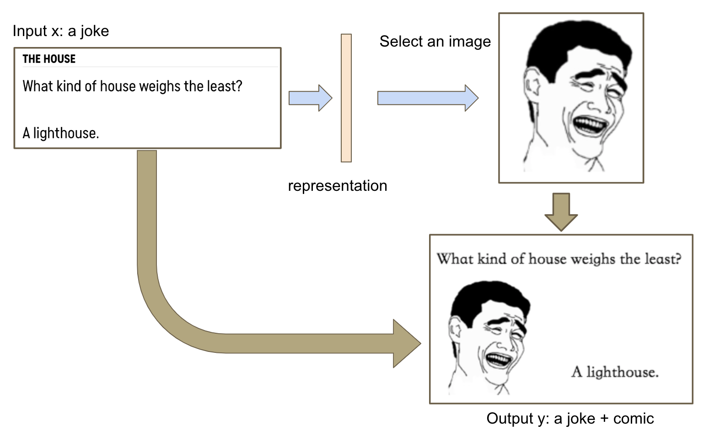
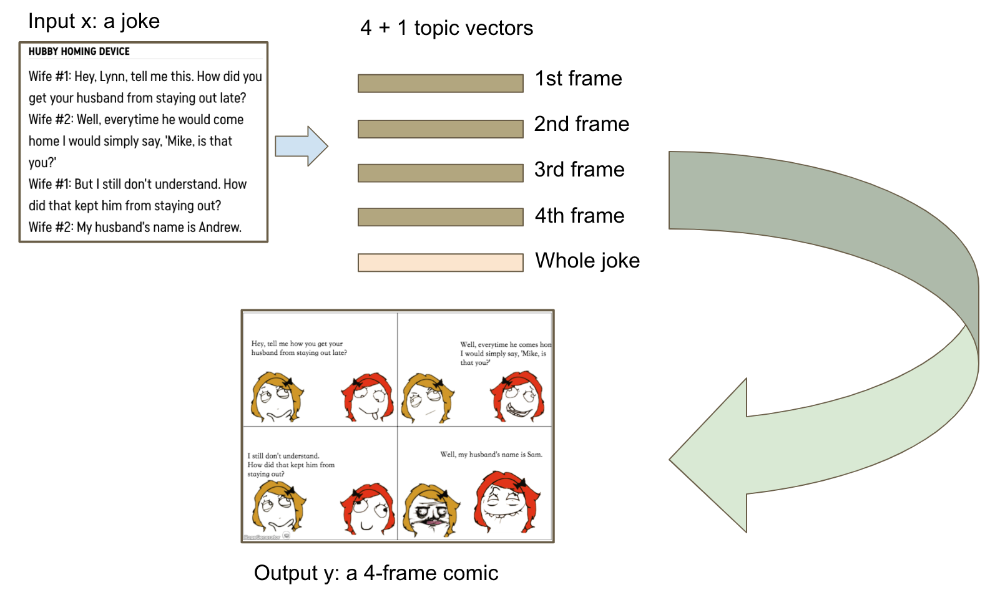

# Joke to Comic Generator

## Background and Motivation
"Humor" is always being a hard topic since it's highly personal and hard to measure.
It's really cool if I can generate a comic from a joke.
This project is the final project for the course "Conginitive Computing 2018".
The goal of this course is "beyond recognition", so I wish to deliver a project that fits this goal.

## Challenge
- Image often contains more information that text. The relation between text and image is one-to-many, and the context also affects choosing "correct" image representation.
- There is no dataset nor previous work for such task.

## Problem Definition
`Given a joke x, output a comic y`

I defined two types of joke comics to lower the difficulty:
- **Type-1**: 
	- The joke is a question and a humorous answer
	- The comic will be an image with the joke itself.

- **Type-2**:
	- The joke is a conversation (mainly two people included)
	- The comic will be an 4-frame cartoons describing the joke.

## Methodology

**Rage Comic Resource**

### Type-1
- For type-1 joke, the main task is to "select" a proper image.
- Additionally, maybe we can use GAN to generate the image instead of selecting it.

### Type-2
- For type-2 joke, the challenge is to split the joke and meanwhile maintaining the relation between each frames

## References
- Joke dataset https://github.com/taivop/joke-dataset

